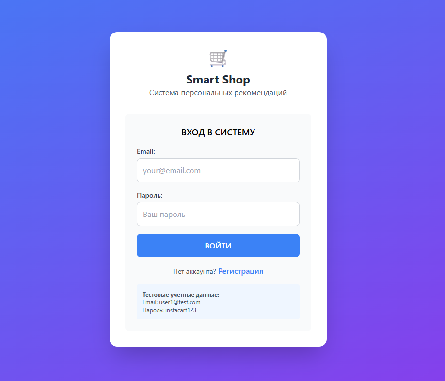
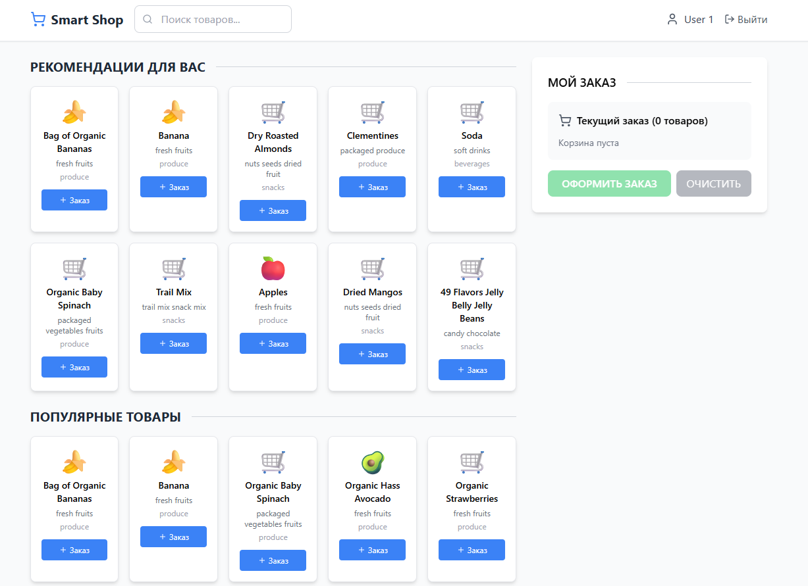
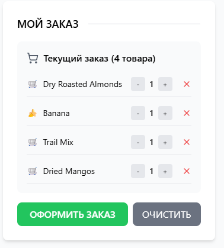

# 🛒 Smart Shop - Система персональных рекомендаций

Smart Shop - это система рекомендаций для интернет-магазина продуктов, построенная на основе микросервисной архитектуры с алгоритмом коллаборативной фильтрации.

## 📸 Скриншоты интерфейса

### Страница входа


### Главная страница



### Корзина покупок



## 📋 Содержание

- [Возможности](#✨-возможности)
- [Алгоритм рекомендаций](#🧮-алгоритм-рекомендаций)
- [Архитектура](#🏗️-архитектура)
- [Структура проекта](#📁-структура-проекта)
- [Требования](#📦-требования)
- [Установка](#🚀-установка)
- [Запуск](#🎮-запуск)
- [Использование](#🌐-использование)
- [API документация](#📚-api-документация)
- [Решение проблем](#🐛-решение-проблем)
- [Примечания](#📝-примечания)
- [Настройка](#🔧-настройка)
- [Контакты и поддержка](#📞-контакты-и-поддержка)

## 🧮 Алгоритм рекомендаций

Система использует **User-Based Collaborative Filtering (коллаборативную фильтрацию)** — тип рекомендательной системы, основанный на поведении похожих пользователей.

### Принцип работы
"Пользователи с похожими покупками предпочитают похожие товары". Система находит людей со схожими вкусами и рекомендует то, что они покупали, а вы — еще нет.

### Ключевые шаги

**1. Матрица покупок**  
Строится таблица "пользователь × товар" с количеством покупок каждого товара каждым пользователем.

**2. TF-IDF взвешивание**  
Редкие покупки важнее массовых. Трюфельное масло (покупают единицы) — сильный сигнал о предпочтениях. Молоко (покупают все) — слабый.

`TF-IDF = √(количество_покупок) × log(всего_пользователей / купивших_товар)`

**3. Поиск похожих пользователей**  
Векторы покупок сравниваются через косинусное сходство. Чем больше совпадений в редких товарах, тем выше схожесть.

`схожесть = (A·B) / (|A| × |B|)`, где A и B — векторы покупок двух пользователей

**4. Формирование рекомендаций**  
Из товаров похожих пользователей выбираются те, что вы не покупали. Финальный рейтинг учитывает схожесть пользователей и популярность товара.

`рейтинг = 0.7 × средняя_схожесть_пользователей + 0.3 × популярность_товара`

**5. Обработка крайних случаев**  
- **Новый пользователь** → топ популярных товаров
- **Мало данных** → дополнение популярными товарами  
- **Разреженная матрица (95%+)** → оптимизированные sparse-алгоритмы для быстрой работы

### Преимущества подхода
- Не требует информации о товарах (только историю покупок)
- Автоматически адаптируется под тренды
- Эффективен даже при малом количестве покупок на пользователя


## ✨ Возможности

- 🎯 **Персональные рекомендации** на основе истории покупок
- 📊 **Популярные товары** для новых пользователей
- 🔍 **Поиск товаров** по названию
- 🛒 **Корзина покупок** с сохранением между сессиями
- 📈 **Аналитика** предпочтений пользователя
- 🔐 **Аутентификация** с JWT токенами
- ⚡ **Кеширование** для быстрой работы


## 🏗️ Архитектура

```
┌──────────────────┐     ┌──────────────────┐     ┌─────────────────┐
│   React App      │────▶│     Nginx        │────▶│   FastAPI App   │
│  (localhost:3000)│     │  (localhost:8000)│     │   (app:8080)    │
└──────────────────┘     └──────────────────┘     └───┬─────────────┘
                                                      │
                    ┌─────────────────────────────────┼──────────────┐
                    │                                 │              │
              ┌─────▼──────┐  ┌──────────────┐  ┌─────▼──────┐  ┌────▼──────┐
              │ PostgreSQL │  │    Redis     │  │  RabbitMQ  │  │ ML Worker │
              │   (5432)   │  │   (6379)     │  │   (5672)   │  │           │
              └────────────┘  └──────────────┘  └────────────┘  └───────────┘
```

### Компоненты системы:

- **Frontend (React)** - интерактивный веб-интерфейс (автозапуск в Docker)
- **Nginx** - reverse proxy и балансировщик нагрузки
- **FastAPI** - основное API приложение с автоматической инициализацией БД
- **PostgreSQL** - база данных для хранения пользователей, товаров и заказов
- **Redis** - кеширование популярных товаров и рекомендаций
- **RabbitMQ** - очередь сообщений для асинхронных задач
- **ML Worker** - обработчик задач машинного обучения

## 📁 Структура проекта

```
mfdp/
├── app/                           # Backend (FastAPI)
│   ├── auth/                      # Аутентификация и авторизация
│   ├── database/                  # База данных и конфигурация
│   ├── models/                    # SQLModel модели
│   ├── routes/                    # API endpoints
│   ├── schemas/                   # Pydantic схемы (DTO)
│   └── services/                  # Бизнес-логика и ML сервисы
│
├── smart-shop-frontend/           # Frontend (React)
│   ├── public/                    # Статические файлы
│   └── src/                       # Исходный код React
│
├── ml_worker/                     # ML Worker (RabbitMQ)
│   └── rmq/                       # RabbitMQ интеграция
│
├── nginx/                         # Конфигурация Nginx
├── data/                          # CSV файлы с данными (создается автоматически)
├── logs/                          # Логи приложения
│
├── docker-compose.yaml            # Оркестрация контейнеров
├── .env                           # Переменные окружения
├── .gitignore                     # Игнорируемые файлы
├── README.md                      # Документация проекта
├── requirements.txt               # Зависимости для скриптов
├── download_data.py               # Скрипт загрузки данных Kaggle
└── check_db.py                    # Скрипт проверки состояния БД
```

## 📦 Требования

- Docker и Docker Compose
- Python 3.8+ (только для загрузки данных)
- Аккаунт на [Kaggle](https://www.kaggle.com) (для загрузки датасета)
- Минимум 4GB свободной памяти
- 2GB свободного места на диске

## 🚀 Установка

### 1. Клонирование репозитория

```bash
git clone https://github.com/dpGorbunov/mfdp.git
cd mfdp
```

### 2. Настройка Kaggle API

Для загрузки данных необходимо настроить доступ к Kaggle API:

1. Зарегистрируйтесь на [Kaggle](https://www.kaggle.com)
2. Перейдите в настройки аккаунта: https://www.kaggle.com/account
3. В разделе API нажмите "Create New API Token"
4. Скачается файл `kaggle.json`
5. Создайте директорию и поместите туда файл:

**Для Windows:**
```bash
mkdir %USERPROFILE%\.kaggle
copy %USERPROFILE%\Downloads\kaggle.json %USERPROFILE%\.kaggle\
```

**Для Linux/Mac:**
```bash
mkdir -p ~/.kaggle
mv ~/Downloads/kaggle.json ~/.kaggle/
chmod 600 ~/.kaggle/kaggle.json
```

### 3. Загрузка данных

```bash
# Установка зависимостей для скрипта
pip install -r requirements.txt

# Загрузка датасета Instacart
python download_data.py
```

Скрипт автоматически:
- Проверит наличие учетных данных Kaggle
- Загрузит датасет (~1.3 GB)
- Распакует файлы в папку `data/`
- Удалит архив после распаковки

### 4. Настройка переменных окружения

Подготовьте файл `.env` в корне проекта. Ниже пример, при необходимости можно изменить пароли:

```env
DB_HOST=db
DB_PORT=5432
DB_USER=postgres
DB_PASS=postgres
DB_NAME=sa
POSTGRES_USER=postgres
POSTGRES_PASSWORD=postgres
POSTGRES_DB=sa
DEBUG=False
SECRET_KEY=d3415ad92f1a1e9cfeca4bf84e5ad841cf3d19e8dfa861505fa0351d30589
REDIS_HOST=redis
REDIS_PORT=6379
RABBITMQ_USER=rmuser
RABBITMQ_PASS=rmpassword
```

## 🎮 Запуск

```bash
# Запуск всех сервисов одной командой
docker-compose up -d --build

# Проверка статуса (все сервисы должны быть "Up")
docker-compose ps
```

**Готово!** Система автоматически:
- ✅ Запустит все сервисы
- ✅ Инициализирует базу данных
- ✅ Импортирует данные (для 100 пользователей)
- ✅ Запустит веб-интерфейс

Подождите 1-2 минуты для полной инициализации.

## 🌐 Использование

После запуска доступны следующие сервисы:

- **Web интерфейс**: http://localhost:3000
- **API**: http://localhost:8000
- **API документация**: http://localhost:8000/docs
- **RabbitMQ Management**: http://localhost:15672
  - Логин: `rmuser`
  - Пароль: `rmpassword`

### Быстрый старт

1. Откройте http://localhost:3000
2. Используйте тестовый аккаунт или создайте новый:
   - Email: `admin@example.com`
   - Пароль: `admin123`

### Работа с системой

1. **Регистрация/Вход** - создайте аккаунт или используйте тестовый
2. **Просмотр товаров** - изучайте популярные товары
3. **Поиск** - найдите нужные продукты
4. **Добавление в корзину** - соберите заказ
5. **Оформление заказа** - после 2-го заказа появятся персональные рекомендации
6. **Рекомендации** - система предложит товары на основе ваших предпочтений

## 📚 API документация

### Основные эндпоинты

#### Аутентификация
- `POST /auth/signup` - регистрация
- `POST /auth/login` - вход
- `GET /auth/me` - текущий пользователь
- `POST /auth/create-test-user` - создание тестового пользователя

#### Товары
- `GET /products/` - список товаров с поиском и фильтрацией
- `GET /products/{id}` - информация о товаре
- `GET /products/departments/list` - список отделов
- `GET /products/aisles/list` - список категорий

#### Рекомендации
- `GET /recommendations/` - получить рекомендации
- `GET /recommendations/preferences` - предпочтения пользователя
- `POST /recommendations/generate/{model_type}` - генерация рекомендаций

#### Заказы
- `POST /orders/` - создать заказ
- `GET /orders/` - история заказов
- `GET /orders/{id}` - детали заказа

### Проверка состояния БД

```bash
# Количество записей в таблицах
docker-compose exec db psql -U postgres -d sa -c "SELECT 'Products:', COUNT(*) FROM product UNION ALL SELECT 'Users:', COUNT(*) FROM users UNION ALL SELECT 'Orders:', COUNT(*) FROM orders;"

# Детальная проверка
docker-compose exec app python check_db.py
```

### Остановка и перезапуск

```bash
# Остановка контейнеров
docker-compose down

# Остановка с удалением данных
docker-compose down -v

# Перезапуск конкретного сервиса
docker-compose restart app
```

## 🐛 Решение проблем

### Нет персональных рекомендаций

**Проблема**: Рекомендации появляются только после 2-го заказа.

**Решение**:
1. Сделайте минимум 2 заказа
2. Нажмите "Сгенерировать рекомендации" в интерфейсе
3. Обновите страницу


## 📝 Примечания

- Первый запуск занимает 5-10 минут (сборка образов)
- БД инициализируется автоматически при первом запуске
- По умолчанию импортируются данные для 100 пользователей
- Для полного датасета измените `IMPORT_USER_LIMIT` в docker-compose.yaml
- Данные сохраняются в Docker volumes между перезапусками

## 🔧 Настройка

### Изменение количества импортируемых пользователей

В `main.py` измените строку:
```python
subprocess.run(["python", "-m", "database.import_fast", "100"], check=True)
```
На нужное количество, например:
```python
subprocess.run(["python", "-m", "database.import_fast", "1000"], check=True)
```


## 📞 Контакты и поддержка

### Автор
- **Имя**: Дима Горбунов
- **GitHub**: [@dpGorbunov](https://github.com/dpGorbunov)
- **Telegram**: @grbn_dima
- **Email**: MarketingServicesGorbunov@yandex.ru
